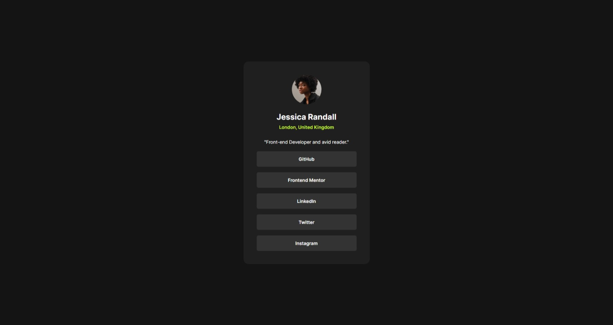
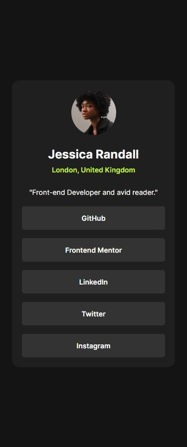

# Frontend Mentor - Social links profile solution

This is a solution to the [Social links profile challenge on Frontend Mentor](https://www.frontendmentor.io/challenges/social-links-profile-UG32l9m6dQ). Frontend Mentor challenges help you improve your coding skills by building realistic projects. 

## Table of contents

- [Overview](#overview)
  - [Screenshot](#screenshot)
  - [Links](#links)
- [My process](#my-process)
  - [Built with](#built-with)
  - [What I learned](#what-i-learned)
  - [Continued development](#continued-development)
  - [Useful resources](#useful-resources)
- [Author](#author)
- [Acknowledgments](#acknowledgments)

## Overview

### Screenshot

Desktop Screenshot

Mobile Screenshot  

### Links

- Solution URL: [Github](https://github.com/adewalemudasiru/Social-Link-Profile)
- Live Site URL: [SolutionPreview](https://adewalemudasiru.github.io/Social-Link-Profile/)

## My process

I created a div container and nested two divs inside it. I used the first div to hold the profile image, name, location and bio. The second div holds the social links. Since the profile details don't have the same space, I had to give each profile element a bottom margin. As for the social links, I used the grid layout and used the gap property to give some space between the links, I then gave the links padding to make it look nice.

### Built with

- Semantic HTML5 markup
- CSS custom properties
- Flexbox
- CSS Grid
- Mobile-first workflow

### What I learned

I learned how to properly center an image without wrapping it in a div

### Continued development

I'm still struggling with javascript and want to improve on it so badly. I'm also trying to understand other flexbox and grid layouts and how to control box sizing with them.

## Author

- Website - [Adewale Mudasiru](https://www.your-site.com)
- Frontend Mentor - [@adewalemudasiru](https://www.frontendmentor.io/profile/adewalemudasiru)
- Twitter - [@ade_mudasiru](https://www.twitter.com/ade_mudasiru)

## Acknowledgments

I did a great Job.